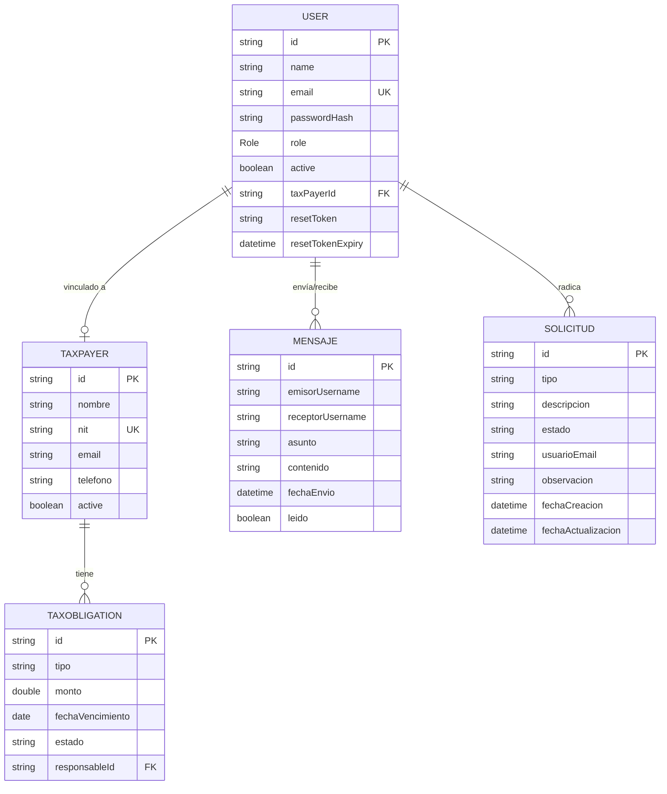

<p align="center">
  
  
  
  
  
</p>

<h1 align="center">Cronos — Sistema de Gestión Tributaria</h1>

<p align="center">
  <strong>Plataforma web empresarial para la gestión integral de obligaciones tributarias, contribuyentes, empleados, notificaciones, mensajería interna y solicitudes con flujo de estados.</strong>
</p>

<p align="center">
  Desarrollado como proyecto académico para la materia <em>Programación Web</em> — Universidad del Norte.
</p>

---

## Tabla de Contenidos

- [Descripción General](#-descripción-general)
- [Arquitectura del Proyecto](#-arquitectura-del-proyecto)
- [Stack Tecnológico](#-stack-tecnológico)
- [Módulos del Sistema](#-módulos-del-sistema)
- [Modelo de Datos](#-modelo-de-datos)
- [Roles y Permisos](#-roles-y-permisos)
- [API REST — Endpoints](#-api-rest--endpoints)
- [Interfaz de Usuario](#-interfaz-de-usuario)
- [Configuración y Ejecución](#-configuración-y-ejecución)
- [Testing](#-testing)
- [Estructura del Proyecto](#-estructura-del-proyecto)
- [Autores](#-autores)

---

## Descripción General

**Cronos** es un sistema de gestión tributaria que permite a una firma contable administrar sus contribuyentes, obligaciones fiscales, empleados y comunicaciones internas desde una única plataforma web.

El sistema implementa:

- **Autenticación y autorización** basada en roles con Spring Security.
- **CRUD completo** de contribuyentes, obligaciones fiscales y empleados.
- **Portal del contribuyente** con acceso restringido a sus propios datos.
- **Calendario fiscal** con vencimientos y recordatorios.
- **Sistema de notificaciones** internas y por correo electrónico.
- **Mensajería interna** entre usuarios del sistema (Módulo 1).
- **Solicitudes con flujo de estados** (PENDIENTE → APROBADA / RECHAZADA) (Módulo 2).
- **Panel administrativo de solicitudes** con KPIs en tiempo real (Módulo 3).
- **Suite de pruebas unitarias** con cobertura de controladores REST (Módulos 4 y 5).
- **Recuperación de contraseña** con tokens de expiración y notificación por email.

---

##  Arquitectura del Proyecto

El proyecto sigue una **arquitectura MVC por capas**, organizada en **módulos de dominio** independientes:

```
┌─────────────────────────────────────────────────────────┐
│                    CAPA DE PRESENTACIÓN                  │
│   Thymeleaf Templates  ·  REST Controllers  ·  CSS      │
├─────────────────────────────────────────────────────────┤
│                    CAPA DE SEGURIDAD                     │
│   Spring Security  ·  RBAC  ·  CSRF  ·  Sesiones        │
├─────────────────────────────────────────────────────────┤
│                    CAPA DE NEGOCIO                        │
│   Services  ·  DTOs  ·  Validaciones                     │
├─────────────────────────────────────────────────────────┤
│                    CAPA DE DATOS                          │
│   Spring Data MongoDB  ·  Repositories  ·  Models        │
├─────────────────────────────────────────────────────────┤
│                    INFRAESTRUCTURA                        │
│   MongoDB Atlas (Cloud)  ·  JavaMail  ·  BCrypt          │
└─────────────────────────────────────────────────────────┘
```

Cada módulo de dominio sigue la estructura:

```
modulo/
├── controller/    # Controladores REST y MVC
├── dto/           # Objetos de transferencia de datos
├── model/         # Entidades de dominio (documentos MongoDB)
├── repository/    # Interfaces Spring Data MongoDB
└── service/       # Lógica de negocio
```

---

## Stack Tecnológico

| Categoría | Tecnología | Versión |
|-----------|-----------|---------|
| **Lenguaje** | Java | 17 |
| **Framework** | Spring Boot | 4.0.6 |
| **Motor de Vistas** | Thymeleaf + thymeleaf-extras-springsecurity6 | — |
| **Base de Datos** | MongoDB Atlas (cloud) | — |
| **Seguridad** | Spring Security (BCrypt 12 rondas) | 7.x |
| **Build Tool** | Apache Maven | 3.x |
| **Correo** | Spring Mail (SMTP / Gmail) | — |
| **Desarrollo** | Spring Boot DevTools + Lombok | — |
| **Testing** | JUnit 5 + MockMvc + Mockito | — |

---

## Módulos del Sistema

### Autenticación y Usuarios (`auth`)

| Característica | Detalle |
|----------------|---------|
| Registro de usuarios | Con validación de duplicados y cifrado BCrypt |
| Login / Logout | Formulario personalizado con sesiones HTTP |
| Recuperación de contraseña | Token de un solo uso con expiración de 24h + email |
| Cambio de contraseña | Validación de contraseña actual |
| Roles | GERENTE, ASESOR, ADMIN, CONTADOR, AUXILIAR_CONTADOR, CONTRIBUYENTE |

---

### Gestión de Contribuyentes (`clientes`)

| Característica | Detalle |
|----------------|---------|
| CRUD completo | Crear, leer, actualizar y eliminar contribuyentes |
| Vinculación con usuario | Asocia un `User` con un `TaxPayer` por email |
| Toggle activo/inactivo | Solo el GERENTE puede activar/desactivar |
| Portal del contribuyente | Vista exclusiva con datos propios del contribuyente |

---

### Obligaciones Tributarias (`obligaciones`)

| Característica | Detalle |
|----------------|---------|
| CRUD de obligaciones | Tipo, monto, fecha de vencimiento, estado |
| Calendario fiscal | Vista mensual con vencimientos codificados por color |
| Mis obligaciones | Vista personal del contribuyente/empleado |
| DTOs | `TaxObligationRequest` para crear/actualizar |

---

### Gestión de Empleados (`empleados`)

| Característica | Detalle |
|----------------|---------|
| CRUD de empleados | Solo accesible por GERENTE, ASESOR y ADMIN |
| Roles laborales | Asignación de roles al registrar empleados |
| Vista lista y detalle | Thymeleaf con layout del sistema |

---

### Notificaciones (`notification`)

| Característica | Detalle |
|----------------|---------|
| Notificaciones internas | Almacenadas en el perfil del usuario (MongoDB) |
| Notificaciones por email | Plantillas Thymeleaf HTML con diseño premium |
| Marcar como leídas | Endpoint para actualizar estado |
| Contador en sidebar | Badge con cantidad de no leídas |

---

### Módulo 1 — Mensajería Interna (`mensajes`)

Sistema de comunicación directa entre usuarios del sistema.

| Característica | Detalle |
|----------------|---------|
| Enviar mensaje | De un usuario autenticado a otro existente |
| Bandeja de entrada | Mensajes recibidos ordenados por fecha (desc) |
| Mensajes enviados | Historial de mensajes enviados |
| Marcar como leído | Solo el receptor puede marcar sus mensajes |
| Contador de no leídos | KPI visible en el panel y sidebar |
| Interfaz gráfica | Vista integrada en `/ui/mensajes` con el design system |

**Modelo de datos — `Mensaje`:**

| Campo | Tipo | Descripción |
|-------|------|-------------|
| `id` | String | Identificador único (generado por MongoDB) |
| `emisorUsername` | String | Email del usuario emisor |
| `receptorUsername` | String | Email del usuario receptor |
| `asunto` | String | Asunto del mensaje |
| `contenido` | String | Cuerpo del mensaje |
| `fechaEnvio` | LocalDateTime | Fecha y hora de envío (automática) |
| `leido` | boolean | Estado de lectura (`false` por defecto) |

---

### Módulo 2 — Solicitudes con Flujo de Estados (`solicitudes`)

Sistema para radicar solicitudes de soporte, acceso o información con flujo de aprobación.

| Característica | Detalle |
|----------------|---------|
| Radicar solicitud | Cualquier usuario autenticado |
| Tipos permitidos | `SOPORTE`, `ACCESO`, `INFORMACIÓN` |
| Flujo de estados | `PENDIENTE` → `APROBADA` / `RECHAZADA` |
| Aprobar/Rechazar | Solo usuarios con rol `ADMIN` |
| Observación | Texto adjunto al aprobar o rechazar |
| Mis solicitudes | El usuario ve solo sus propias solicitudes |
| Interfaz gráfica | Vista integrada en `/ui/solicitudes/mis-solicitudes` |

**Modelo de datos — `Solicitud`:**

| Campo | Tipo | Descripción |
|-------|------|-------------|
| `id` | String | Identificador único (generado por MongoDB) |
| `tipo` | TipoSolicitud | Enum: `SOPORTE`, `ACCESO`, `INFORMACION` |
| `descripcion` | String | Detalle de la solicitud |
| `estado` | EstadoSolicitud | Enum: `PENDIENTE`, `APROBADA`, `RECHAZADA` |
| `usuarioEmail` | String | Email del usuario que radicó |
| `observacion` | String | Comentario del admin al aprobar/rechazar |
| `fechaCreacion` | LocalDateTime | Fecha de radicación (automática) |
| `fechaActualizacion` | LocalDateTime | Última actualización del estado |

---

### Módulo 3 — Panel Administrativo de Solicitudes

Dashboard visual con KPIs y tabla de gestión para el administrador.

| Característica | Detalle |
|----------------|---------|
| KPIs en tiempo real | Total, Pendientes, Aprobadas, Rechazadas |
| Tabla de solicitudes | Vista completa con filtros por estado |
| Acceso | Solo `ADMIN` vía `/admin/solicitudes/panel` |
| Diseño integrado | Usa el layout y design system del proyecto |

---

### Módulos 4 y 5 — Pruebas Unitarias

Suite de pruebas con JUnit 5 y Spring MockMvc.

| Suite de Tests | Cobertura |
|----------------|-----------|
| `MensajeControllerTest` | Envío, bandeja, enviados, marcar leído, no leídos |
| `SolicitudControllerTest` | Radicar, listar propias, listar todas, aprobar, rechazar |
| Tests existentes | Auth, Clientes, Obligaciones, Notificaciones, Config |

---

## Modelo de Datos



---

## Roles y Permisos

| Rol | Permisos principales |
|-----|---------------------|
| `GERENTE` | CRUD de contribuyentes, empleados, obligaciones. Toggle activo. Acceso total al dashboard. |
| `ASESOR` | Lectura de contribuyentes y obligaciones. Gestión de empleados. |
| `ADMIN` | Panel de solicitudes. Aprobar/rechazar solicitudes. Listar todas las solicitudes. |
| `CONTADOR` | Lectura de obligaciones y dashboard. |
| `AUXILIAR_CONTADOR` | Lectura de obligaciones y dashboard. |
| `CONTRIBUYENTE` | Portal personal. Ver sus propias obligaciones. |
| **Todos (autenticados)** | Mensajería interna. Radicar solicitudes. Ver sus solicitudes. |

---

## API REST — Endpoints

### Mensajería Interna (`/api/mensajes`)

| Método | Endpoint | Descripción | Acceso |
|--------|----------|-------------|--------|
| `POST` | `/api/mensajes` | Enviar un mensaje | Autenticado |
| `GET` | `/api/mensajes/recibidos` | Bandeja de entrada | Autenticado |
| `GET` | `/api/mensajes/enviados` | Mensajes enviados | Autenticado |
| `PUT` | `/api/mensajes/{id}/leer` | Marcar como leído | Autenticado (receptor) |
| `GET` | `/api/mensajes/no-leidos` | Contar no leídos | Autenticado |

**Ejemplo — Enviar un mensaje:**

```json
POST /api/mensajes
Content-Type: application/json

{
  "destinatarioUsername": "asesor@cronos.com",
  "asunto": "Consulta sobre declaración",
  "contenido": "Buenos días, tengo una duda sobre la declaración de renta..."
}
```

**Respuesta (201 Created):**

```json
{
  "id": "6654a1b2c3d4e5f6a7b8c9d0",
  "emisorUsername": "contribuyente@cronos.com",
  "receptorUsername": "asesor@cronos.com",
  "asunto": "Consulta sobre declaración",
  "contenido": "Buenos días, tengo una duda sobre la declaración de renta...",
  "fechaEnvio": "2026-05-26T19:00:00",
  "leido": false
}
```

---

### Solicitudes con Flujo de Estados (`/api/solicitudes`)

| Método | Endpoint | Descripción | Acceso |
|--------|----------|-------------|--------|
| `POST` | `/api/solicitudes` | Radicar solicitud | Autenticado |
| `GET` | `/api/solicitudes/mis-solicitudes` | Ver solicitudes propias | Autenticado |
| `GET` | `/api/solicitudes` | Listar todas (admin) | `ADMIN` |
| `PUT` | `/api/solicitudes/{id}/aprobar` | Aprobar solicitud | `ADMIN` |
| `PUT` | `/api/solicitudes/{id}/rechazar` | Rechazar solicitud | `ADMIN` |

**Ejemplo — Radicar solicitud:**

```json
POST /api/solicitudes
Content-Type: application/json

{
  "tipo": "SOPORTE",
  "descripcion": "No puedo acceder al calendario fiscal desde mi portal."
}
```

**Ejemplo — Aprobar solicitud (Admin):**

```json
PUT /api/solicitudes/{id}/aprobar?observacion=Solicitud aprobada, se habilitará el acceso.
```

---

### Contribuyentes (`/api/clientes`, `/api/contribuyente`)

| Método | Endpoint | Descripción | Acceso |
|--------|----------|-------------|--------|
| `GET` | `/api/contribuyente` | Listar contribuyentes | GERENTE, ASESOR |
| `POST` | `/api/clientes` | Crear contribuyente | GERENTE |
| `PUT` | `/api/clientes/{id}` | Actualizar contribuyente | GERENTE |
| `DELETE` | `/api/clientes/{id}` | Eliminar contribuyente | GERENTE |
| `PATCH` | `/api/contribuyente/{id}/toggle-active` | Activar/desactivar | GERENTE |

---

### Obligaciones Tributarias (`/api/obligaciones`)

| Método | Endpoint | Descripción | Acceso |
|--------|----------|-------------|--------|
| `GET` | `/api/obligaciones` | Listar obligaciones | Empleados |
| `POST` | `/api/obligaciones` | Crear obligación | Empleados |
| `PUT` | `/api/obligaciones/{id}` | Actualizar obligación | Empleados |
| `DELETE` | `/api/obligaciones/{id}` | Eliminar obligación | Empleados |

---

## Interfaz de Usuario

### Vistas MVC (Thymeleaf)

| Ruta | Vista | Descripción |
|------|-------|-------------|
| `/login` | Login | Formulario de autenticación |
| `/forgot-password` | Recuperar contraseña | Solicitar token de recuperación |
| `/reset-password?token=...` | Restablecer contraseña | Formulario con token |
| `/dashboard` | Dashboard principal | KPIs, calendario, accesos rápidos |
| `/calendario-fiscal` | Calendario fiscal | Vista mensual de vencimientos |
| `/clientes` | Gestión de clientes | CRUD de contribuyentes |
| `/obligaciones` | Obligaciones tributarias | CRUD de obligaciones |
| `/mis-obligaciones` | Mis obligaciones | Vista personal |
| `/empleados` | Gestión de empleados | CRUD de empleados |
| `/notificaciones` | Centro de notificaciones | Listado y gestión |
| `/reportes` | Reportes | Dashboard de reportes |
| `/portal` | Portal contribuyente | Acceso exclusivo para contribuyentes |
| `/ui/mensajes` | **Mensajería** | Bandeja + redactar (Módulo 1) |
| `/ui/solicitudes/mis-solicitudes` | **Mis Solicitudes** | Radicar + historial (Módulo 2) |
| `/admin/solicitudes/panel` | **Panel Solicitudes** | KPIs + tabla admin (Módulo 3) |
| `/configuracion` | Configuración | Ajustes del sistema |

### Navegación (Sidebar)

El sidebar incluye enlaces a todos los módulos, con visibilidad controlada por rol:

- **Dashboard** — todos los empleados
- **Calendario Fiscal** — todos los empleados
- **Mis Obligaciones** — todos los empleados
- **Documentos** — todos
- **Mensajes** — todos los autenticados
- **Mis Solicitudes** — todos los autenticados
- **Admin Solicitudes** — solo `ADMIN`
- **Reportes** — todos los empleados
- **Equipo** — GERENTE, ASESOR, ADMIN
- **Configuración** — GERENTE, ASESOR, ADMIN

---

## Configuración y Ejecución

### Prerrequisitos

- **Java 17** o superior
- **Maven 3.8+**
- Cuenta en **MongoDB Atlas** (o MongoDB local)
- (Opcional) Cuenta de correo SMTP para notificaciones por email

### 1. Clonar el repositorio

```bash
git clone https://github.com/AndressToscanom30/proyecto-ProWeb.git
cd proyecto-ProWeb
git checkout previo-final-02230131035
```

### 2. Configurar variables de entorno

Crea un archivo `.env` en la raíz del proyecto:

```properties
# MongoDB Atlas
MONGO_ATLAS_USER_NAME=tu_usuario
MONGO_ATLAS_PASSWORD=tu_contraseña

# Correo SMTP (opcional)
EMAIL_USER=tu_correo@gmail.com
EMAIL_PASSWORD=tu_app_password
EMAIL_FROM=tu_correo@gmail.com
```

> **Nota:** Si usas Gmail, necesitas una [App Password](https://myaccount.google.com/apppasswords), no tu contraseña regular.

### 3. Compilar y ejecutar

```bash
# Compilar el proyecto
mvn compile

# Ejecutar los tests
mvn test

# Iniciar la aplicación
mvn spring-boot:run
```

### 4. Acceder a la aplicación

Abre tu navegador en: **http://localhost:8080**

### Usuarios de prueba (sembrados automáticamente)

El `DataInitializer` crea automáticamente los siguientes usuarios al arrancar:

| Email | Contraseña | Rol |
|-------|-----------|-----|
| `gerente@cronos.com` | `gerente123` | GERENTE |
| `admin@cronos.com` | `admin123` | ADMIN |

> Puedes registrar más usuarios desde la aplicación. Los contribuyentes se crean y vinculan desde el módulo de clientes.

---

## Testing

### Ejecutar todos los tests

```bash
mvn test
```

### Tests por módulo

| Clase de Test | Módulo | Tests |
|---------------|--------|-------|
| `MensajeControllerTest` | Mensajería (M1) | 5 tests — envío, bandeja, enviados, marcar leído, no leídos |
| `SolicitudControllerTest` | Solicitudes (M2) | 5 tests — radicar, listar propias, listar todas, aprobar, rechazar |
| `PortalViewControllerTest` | Portal contribuyente | Tests de vistas MVC |
| `AuthControllerTest` | Autenticación | Tests de login/registro |
| `TaxObligationControllerTest` | Obligaciones | Tests CRUD |
| `NotificationControllerTest` | Notificaciones | Tests de notificaciones |
| `SecurityConfigTest` | Seguridad | Tests de configuración |

### Tecnologías de testing

- **JUnit 5** — Framework de pruebas
- **MockMvc** — Pruebas de controladores sin servidor
- **Mockito** — Mocking de servicios y repositorios
- **@WebMvcTest** — Slice testing de la capa web
- **@WithMockUser** — Simulación de usuarios autenticados con roles

---

##  Estructura del Proyecto

```
proyecto-ProWeb/
├── pom.xml                                    # Configuración Maven
├── README.md                                  # Este archivo
├── .env                                       # Variables de entorno (no versionado)
│
├── src/main/java/com/cronos/gestiontributaria/
│   ├── GestionTributariaApplication.java      # Clase principal
│   │
│   ├── auth/                                  # Autenticación y Usuarios
│   │   ├── controller/
│   │   │   ├── AuthController.java            #   Login, registro, dashboard
│   │   │   └── PasswordController.java        #   Recuperación de contraseña
│   │   ├── model/
│   │   │   ├── User.java                      #   Documento de usuario
│   │   │   └── Role.java                      #   Modelo de rol con permisos
│   │   ├── repository/
│   │   │   └── UserRepository.java            #   Repositorio MongoDB
│   │   └── service/
│   │       ├── UserService.java               #   Lógica de negocio de usuarios
│   │       └── CustomUserDetailsService.java  #   Integración Spring Security
│   │
│   ├── clientes/                              # Contribuyentes
│   │   ├── controller/
│   │   │   ├── TaxPayerViewController.java    #   Vistas MVC
│   │   │   ├── TaxPayerRestController.java    #   API REST
│   │   │   └── PortalViewController.java      #   Portal del contribuyente
│   │   ├── model/
│   │   │   └── TaxPayer.java                  #   Documento contribuyente
│   │   ├── repository/
│   │   │   └── TaxPayerRepository.java
│   │   └── service/
│   │       └── TaxPayerService.java
│   │
│   ├── obligaciones/                          # Obligaciones Tributarias
│   │   ├── controller/
│   │   │   ├── TaxObligationViewController.java
│   │   │   └── MyObligationsViewController.java
│   │   ├── dto/
│   │   │   └── TaxObligationRequest.java
│   │   ├── model/
│   │   │   └── TaxObligation.java
│   │   ├── repository/
│   │   │   └── TaxObligationRepository.java
│   │   └── service/
│   │       └── TaxObligationService.java
│   │
│   ├── empleados/                             # Gestión de Empleados
│   │   ├── controller/
│   │   │   └── EmployeeViewController.java
│   │   ├── model/
│   │   ├── repository/
│   │   └── service/
│   │
│   ├── mensajes/                              # Módulo 1 — Mensajería
│   │   ├── controller/
│   │   │   ├── MensajeController.java         #   API REST (/api/mensajes)
│   │   │   └── MensajeUIController.java       #   Vista MVC (/ui/mensajes)
│   │   ├── dto/
│   │   │   └── MensajeRequest.java            #   DTO de entrada
│   │   ├── model/
│   │   │   └── Mensaje.java                   #   Documento MongoDB
│   │   ├── repository/
│   │   │   └── MensajeRepository.java         #   Repositorio con queries
│   │   └── service/
│   │       └── MensajeService.java            #   Lógica de envío y consulta
│   │
│   ├── solicitudes/                           # Módulo 2 — Solicitudes
│   │   ├── controller/
│   │   │   ├── SolicitudController.java       #   API REST (/api/solicitudes)
│   │   │   ├── SolicitudPanelController.java  #   Panel admin (Módulo 3)
│   │   │   └── MisSolicitudesUIController.java #  Vista usuario (/ui/solicitudes)
│   │   ├── dto/
│   │   │   └── SolicitudRequest.java          #   DTO de entrada
│   │   ├── model/
│   │   │   ├── Solicitud.java                 #   Documento MongoDB
│   │   │   ├── TipoSolicitud.java             #   Enum con @JsonCreator
│   │   │   └── EstadoSolicitud.java           #   Enum del flujo de estados
│   │   ├── repository/
│   │   │   └── SolicitudRepository.java       #   Repositorio con conteos
│   │   └── service/
│   │       └── SolicitudService.java          #   Lógica de flujo de estados
│   │
│   ├── notification/                          # Notificaciones
│   │   ├── controller/
│   │   │   └── NotificationViewController.java
│   │   ├── model/
│   │   │   └── Notification.java
│   │   ├── service/
│   │   │   └── NotificationService.java
│   │   └── view/
│   │
│   ├── calendarios/                           # Calendario Fiscal
│   │
│   ├── common/                                # Utilidades comunes
│   │
│   └── config/                                # Configuración
│       ├── SecurityConfig.java                #   Cadena de filtros de seguridad
│       └── DataInitializer.java               #   Seed de datos (usuarios default)
│
├── src/main/resources/
│   ├── application.properties                 # Configuración de la app
│   ├── static/
│   │   └── css/
│   │       └── app.css                        # Design system completo
│   └── templates/
│       ├── fragments/
│       │   └── layout.html                    # Layout base (sidebar + topbar)
│       ├── auth/                              # Vistas de autenticación
│       ├── admin/
│       │   ├── mensajes/
│       │   │   └── panel.html                 # UI de mensajería
│       │   └── solicitudes/
│       │       ├── panel.html                 # Panel admin de solicitudes
│       │       └── mis_solicitudes.html        # UI mis solicitudes
│       ├── dashboard.html                     # Dashboard principal
│       ├── clientes/                          # Vistas de contribuyentes
│       ├── obligaciones/                      # Vistas de obligaciones
│       ├── empleados/                         # Vistas de empleados
│       ├── notificaciones/                    # Vistas de notificaciones
│       ├── portal/                            # Portal del contribuyente
│       ├── reportes/                          # Vistas de reportes
│       └── email/                             # Plantillas de correo HTML
│
└── src/test/java/com/cronos/gestiontributaria/
    ├── GestionTributariaApplicationTests.java
    ├── mensajes/
    │   └── MensajeControllerTest.java         # Tests Módulo 1
    ├── solicitudes/
    │   └── SolicitudControllerTest.java       # Tests Módulo 2
    ├── auth/
    ├── clientes/
    ├── config/
    ├── notification/
    └── obligaciones/
```

---

## Autores

| Nombre |
|--------|
| **Keiver Castellanos - 02230131035** |

---

<p align="center">
  <sub>Hecho con y Spring Boot - Universidad del Norte, 2026</sub>
</p>
